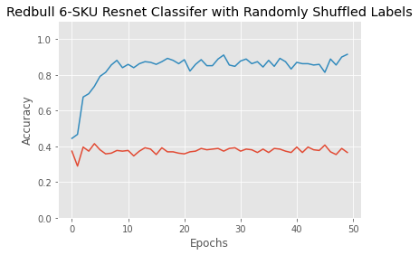

# Rethinking Generalization
Simplest demonstration that neural nets can memorize randomly labelled data. This observation was made in [understanding deep learning requires rethinking generalization](https://arxiv.org/abs/1611.03530).

## Redbull Classifier
A simple model (a pretrained Resnet 18) can acheive high accuracy (90-100%) on train data with randomly shuffled labels. However, it cannot perform better than random on test data (which are not randomly shuffled).

